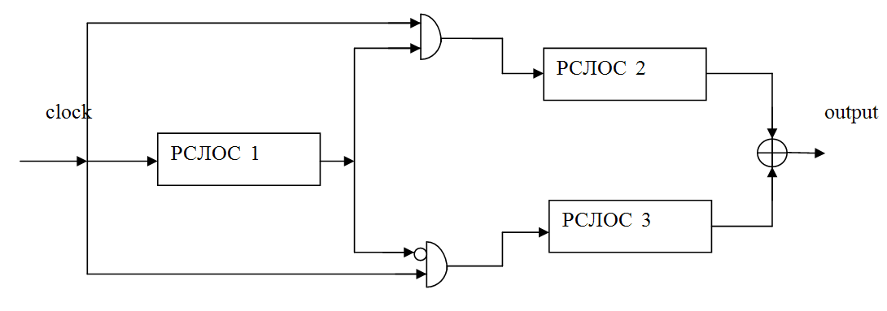

### Генераторы, основанные на управлении синхросигналом
В нелинейных комбинациях генераторов и генераторах на нелинейных фильтрах перемещение данных во всех РСЛОС контролируется одним синхросигналом.
Основная идея функционирования рассматриваемого типа генераторов — внести нелинейность в работу генераторов потока ключей, основанных на РСЛОС, путём управления синхросигналом одного регистра выходной последовательностью другого.
Есть 2 типа генераторов, основанных на управлении синхросигналом:
1. генератор переменного шага 
2. сжимающий генератор.

#### Генератор переменного шага

**Основная идея:**

РСЛОС 1 используется для управления передвижением битов двух других РСЛОС 2 и 3.

**Алгоритм работы:**

1. Регистр РСЛОС 1 синхронизован внешним синхросигналом
2. Если на выходе регистра РСЛОС 1 единица, то на регистр РСЛОС 2 подаётся синхросигнал, а РСЛОС 3 повторяет свой предыдущий выходной бит (для начального момента времени предыдущий выходной бит РСЛОС 3 принимается равным 0)
3. Если на выходе регистра РСЛОС 1 ноль, то на регистр РСЛОС 3 подаётся синхросигнал, а РСЛОС 2 повторяет свой предыдущий выходной бит (для начального момента времени предыдущий выходной бит РСЛОС 2 также принимается равным 0)
4. Выходная последовательность битов генератора с переменным шагом является результатом применения операции побитового исключающего ИЛИ к выходным последовательностям регистров РСЛОС 2 и РСЛОС 3.

*Увеличение безопасности генераторов с переменным шагом:*

* длины регистров РСЛОС 1, РСЛОС 2, РСЛОС 3 должны быть выбраны попарно простыми числами
* длины этих регистров должны быть близкими числами.
