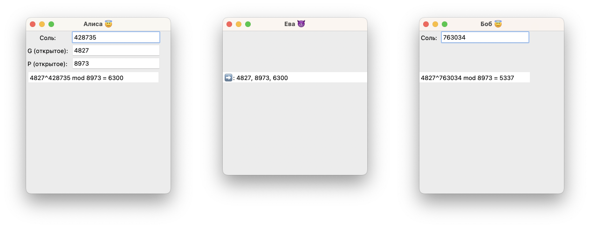
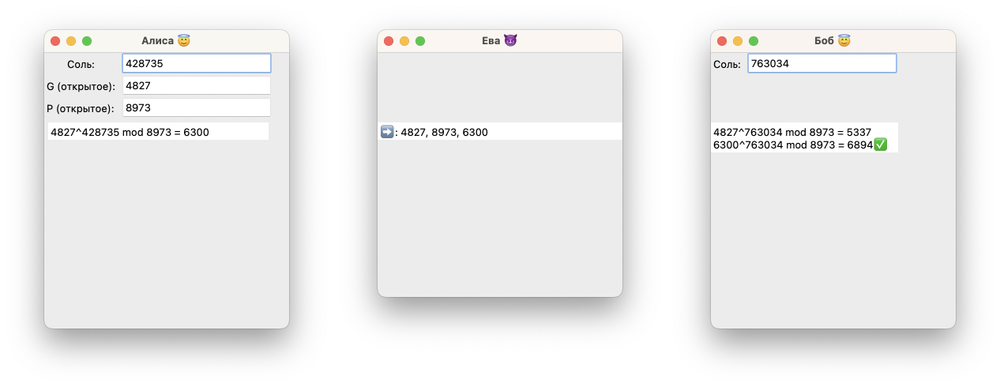
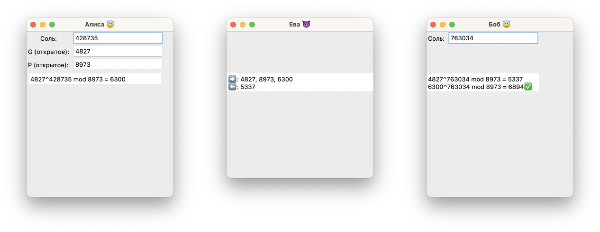
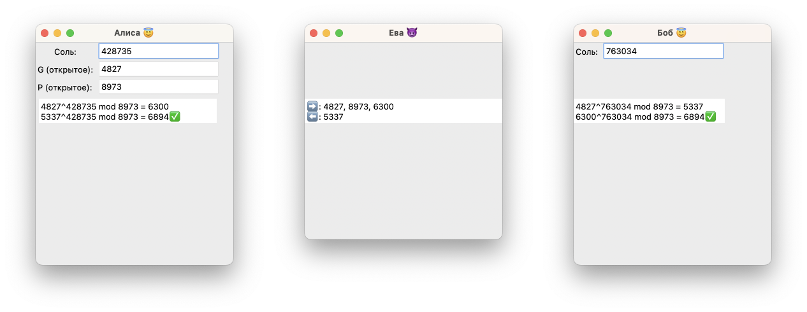

### Протокол Диффи — Хеллмана
Протокол Ди́ффи — Хе́ллмана (англ. Diffie–Hellman key exchange protocol, DH) — криптографический протокол, позволяющий двум и более сторонам получить общий секретный ключ, используя незащищенный от прослушивания канал связи. Полученный ключ используется для шифрования дальнейшего обмена с помощью алгоритмов симметричного шифрования.
Схема открытого распределения ключей, предложенная Диффи и Хеллманом, произвела настоящую революцию в мире шифрования, так как снимала основную проблему классической криптографии — проблему распределения ключей.

#### Описание алгоритма

Предположим, существует два абонента: Алиса и Боб и злой криптоаналитик: Ева. Обоим абонентам известны некоторые два числа g и p (открытый ключ; обычно генерируется на одной стороне и передается другой), которые могут быть известны также другим заинтересованным лицам. Для того, чтобы создать неизвестный более никому секретный ключ, оба абонента генерируют большие случайные числа (соль): Алиса — число $a$, Боб — число $b$.

Затем Алиса вычисляет остаток от деления (1): $A=g^a \bmod p (1)$

и по незащищенному от прослушивания каналу пересылает Бобу {G, P, A}.

Боб вычисляет остаток от деления (2): $B=g^b \bmod p (2)$

И на основе имеющегося у него $b$ и полученного по сети $A$ вычисляет значение (4): $A^b\bmod p=g^{ab}\bmod p (4)$

После чего передаёт обратно Алисе $B$.

Предполагается, что Ева может получить все значения, передаваемые между Алисой и Бобом, но не модифицировать их (то есть, у нее нет возможности вмешаться в процесс передачи).
На следующем этапе Алиса на основе имеющегося у неё $a$ и полученного по сети $B$ вычисляет значение (3): $B^a\bmod p=g^{ab}\bmod p (3)$

Как нетрудно видеть, у Алисы и Боба получилось одно и то же число (5): $K=g^{ab}\bmod p (5)$
Его они и могут использовать в качестве секретного ключа, поскольку здесь злоумышленник встретится с практически неразрешимой (за разумное время) проблемой вычисления (3) или (4) по перехваченным $g^a \bmod p$ и $g^b \bmod p$, если числа $p, a, b$ выбраны достаточно большими.
