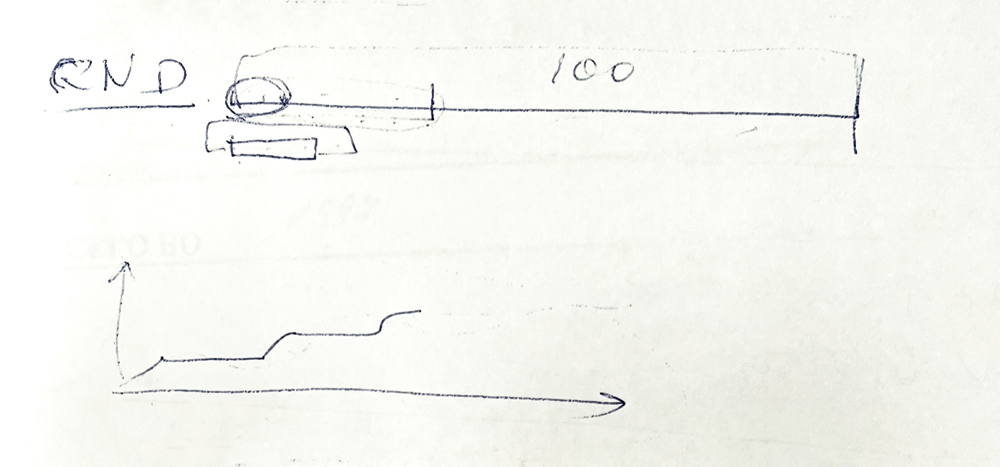
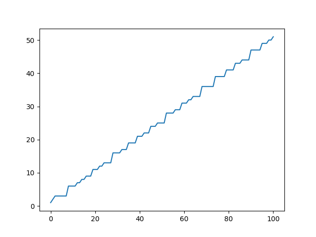

# Задание:
> на основе [ЛАБЫ 2 из прошлого семестра (про регистры сдвига)](https://github.com/kidavspb/Cryptography-5and6sem/tree/main/lab2)

Cгенерировать с помощью своих регистров случайную последовательность длинной в 100 бит, а затем по битам вычислить 100 раз линейную сложность. Сначала для первого бита, потом для первых двух, для первых трех, четырех и так до конца

Если все сделать правильно, то получится график как на картинке:\

# Результат:
Линейную сложность поможет вычислить **алгоритм Берлекампа-Месси** — это алгоритм, который находит кратчайший регистр сдвига с линейной обратной связью (LFSR) для заданной двоичной выходной последовательности. С помощью него и был получен следующий график:\

